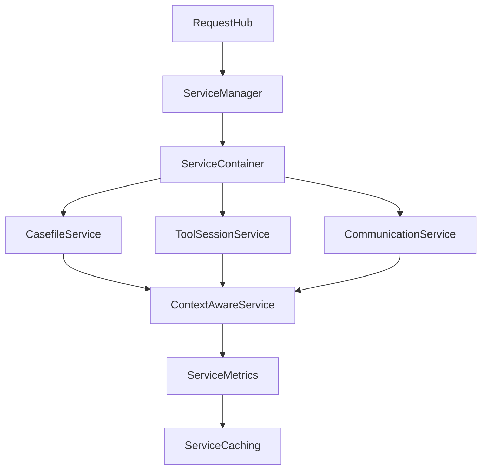

# coreservice Overview

**Tags:** `dependency-injection` `context` `metrics` `resilience`

## Directory Snapshot

```text
src/coreservice/
  service_container.py      # DI hub: ServiceContainer, ServiceManager
  context_aware_service.py  # Context propagation, lifecycle hooks
  service_caching.py        # Cache, connection pool, circuit breaker
  service_metrics.py        # Metrics collector, profiler, dashboard
  config.py                 # MDSConfig, env validation
  health_checker.py         # System and service health checks
  request_hub.py            # Request-Action-Response orchestration
  id_service.py             # ID generation utilities
```

## Key Abstractions

| Concept | Definition | Related Modules |
| --- | --- | --- |
| ServiceContainer | Lazy DI registry for repositories/services | `service_container.py` |
| ServiceManager | Grouped high-level accessor | `service_container.py` |
| ContextAwareService | Base class wrapping execution with context | `context_aware_service.py` |
| ServiceContext | Request/session metadata | `context_aware_service.py` |
| Cache / ConnectionPool | Resilience primitives (LRU/LFU/TTL) | `service_caching.py` |
| CircuitBreaker | Failure isolation & recovery | `service_caching.py` |
| MetricsCollector | Counters/gauges/timers | `service_metrics.py` |
| PerformanceProfiler | Async benchmarking support | `service_metrics.py` |
| MDSConfig | Typed configuration tree | `config.py` |
| RequestHub | R-A-R orchestrator | `request_hub.py` |

### Context Framework Details

| Element | Description | Notes |
| --- | --- | --- |
| `ServiceContext` | Pydantic model carrying request, session, user, correlation data | Canonical context object injected into every execution |
| `*ContextProvider` | Providers (User/Session/Request) populate `ServiceContext` from different viewpoints | Async + sync `provide` methods for flexible enrichment |
| `ContextAwareService` | Abstract base wrapping `_execute_with_context` | Defines async/sync entry points, lifecycle hooks `_before_execute`, `_after_execute`, `_on_error` |
| Metrics Hooks | Abstract `_record_metrics` / `_update_metadata` methods | Subclasses (CasefileService, ToolSessionService, CommunicationService) implement domain metrics |
| Lifecycle Hooks | Pre/post/error hooks for logging, tracing, audit trails | Future toolset operations become first-class citizens with consistent metadata |

### Resilience Toolkit (service_caching.py)

| Component | Purpose | Usage Pattern |
| --- | --- | --- |
| `Cache` | In-memory store with LRU/LFU/TTL/size strategies | Services cache repository results or outbound call responses to reduce Firestore/API load |
| `CachedServiceMixin` | Drop-in mixin adding cache helpers | Domain services mix in for uniform cache instrumentation |
| `ConnectionPool` | Async pool maintaining healthy client connections | Wraps expensive clients (Firestore, external APIs) for reuse and periodic health checks |
| `CircuitBreaker` | Guard against repeated failures, supports half-open recovery | Protects external services; registry coordinates breakers across domains |
| `ServiceCache` | Registry managing cache instances per service | Supports multi cache strategies per environment |
| `CircuitBreakerRegistry` | Central lookup for breakers | Enables config-driven breaker policies |

> These primitives are opt-in: individual services decide when to apply caching/pooling/breakers. They feed metrics/context data so hits/misses and breaker state are traceable per request.

### Observability Stack (service_metrics.py)

| Component | Purpose | Notes |
| --- | --- | --- |
| `MetricsCollector` | Core API for counters, gauges, histograms, timers | Thread-safe, async-aware; services inject and record within context hooks |
| `ServiceMetrics` | Domain-focused wrapper bundling collectors per service | Keeps metric names/tag conventions consistent |
| `PerformanceProfiler` | Benchmarks async/sync call performance, percentile analysis | Useful for profiling toolset execution flows |
| `MetricsDashboard` | Aggregates collectors for reporting/export | Can back dashboards / alerts |
| `OptimizedServiceMixin` | Adds profiling + metric helpers to services | Complements `CachedServiceMixin` for holistic performance management |

> Tools and methods can instantiate these collectors when needed, but the standard pattern is: services own metrics objects and expose results to the tool execution layer via context metadata.

### RequestHub Orchestration (request_hub.py)

| Element | Description | Notes |
| --- | --- | --- |
| `RequestHub.dispatch` | Routes `BaseRequest` objects by `operation` to specific handlers | Covers casefile, tool session, chat, composite workflows |
| Handler methods | `_execute_*` functions that prep context, run service calls, execute hooks | All follow R-A-R: prepare context → call service → update metadata |
| `PolicyPatternLoader` | Injects default context requirements & hooks based on policy hints | Ensures consistent governance across operations |
| Hook system | `metrics`, `audit`, `session_lifecycle` built-in, extensible via `hook_handlers` | Hooks receive stage (`pre`/`post`) + request/response for side-effects |
| Context enrichment | `_prepare_context` hydrates session/casefile snapshots when required | Provides downstream hooks/services with rich metadata |
| Composite flows | Orchestrates multi-step operations (casefile-with-session, session-with-casefile) | Demonstrates branching and hook aggregation |

> RequestHub is the bridge between tool engineering and service execution. It standardizes how requests move through policies, hooks, and context so new operations plug into the same audit/metrics pipeline.

## Interaction Flow



## External Touchpoints

| Concern | Touching Modules | Notes |
| --- | --- | --- |
| Configuration | `config.py`, `.env` | Env-driven toggles for caching, circuit breakers |
| Health APIs | `health_checker.py`, `pydantic_api/routers/health.py` | Exposes `/health`, `/ready`, `/live` |
| Persistence | Repositories injected via container | Firestore adapters per service |
| Observability | `service_metrics.py`, `context_aware_service.py` | Context IDs, metrics, profiling |
| Resilience | `service_caching.py` | Cache strategies, circuit breaker registry |

## Open Questions / Next Actions

- Confirm auth token routing data in `authservice` provides the expected endpoint hints.
- Document cache eviction defaults per environment within `config.py` + config inventory.
- Design load-test suite for YAML toolset execution (consider workers, scenario coverage).

## Navigation

- [[../BRANCH_DEVELOPMENT_PLAN.md|Branch Development Plan]]
- [[METHOD_PARAMETER_INTEGRATION|Parameter Mapping Guide]]
- [[TOOL_DEVELOPMENT_WORKFLOW|Tool Development Workflow]]
